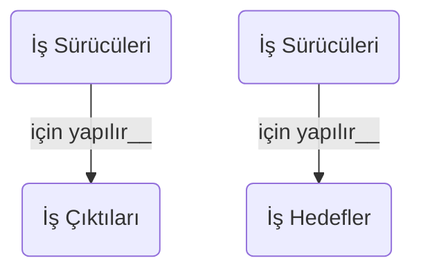

# Kapsam

Operasyonel Konsept Dokümanu (OpKonsDok) İş Geliştirme ve pazarlamaya yönelik olarak yapılacak olan iletişimde kullanılacak temel doküman olarak değerlendirilebilir. Doküman sadece müşterilere değil aynı zamanda çözüm tarafında tasarımcılar ile ilitişim için de kullanılacaktır.

Bu doküman bu kapsamda hazırlanacak olan OpKonDok'un bazı temel içerenlerini açıklamak ve özel olarak öne çıkarılacak yönlerini vurgulamak amacıyla hazırlanmıştır.

# İçerik

Operasyonel Konsept Dokümanı [template.Operasyonel Konsept (OpKon)](:/f923f9e459b346a49dc5351417b1e15a) şablonu baz alınarak hazırlanacaktır.

Söz konusu şablon, Enterprise Architect yazılımda bulunan şablon kullanılarak hazırlanmıştır. Bu şablon EA dünyaca bilenen bir yazılım olduğu için tercih edilmştir. Şablonun içeriği DI-IPSC-81430A (2013)  veri unsuru ve STM kalite sisteminde yar alan şablon ile içerik olarak tamamen aynıdır. Şablonda açıklama alanları EA yazılımı şablonun açıklamalarıdır. Daha detaylı açıklama için DI-IPSC-81430A dokümanı incelenmelidir.

Jorgensen tarafından hazırlanan doküma ([@jorgensen_224_2002](http://dx.doi.org/10.1002%2Fj.2334-5837.2002.tb02463.x)) Operasyonel Konsept doküman içeriğini bir seviye daha açıklamaktadır. Ayrıca dokümanda yer alabilecek grafiksel anlatımların özellikle UML kapsamında kullanımını örneklendirmektedir.


# Açıklamalar

## Süreç İle İlişkisi 

Operasyonel Konsept dokümanı **gereksinim hazırlama** sürecinin başlangıç noktası ve en temel bileşenlerinden birisidir.

!!!warning  Operasyonel Konseptin Temel Özelliği
Operasyonel Konsept dokümanı sistemin kullanıcısı bakış açısından hazırlanır. 
!!!!

Kopseptin oluşturulması ve Sistemin tanımlanması ([definition of system](https://www.sebokwiki.org/wiki/System_Definition)) aktiviteleri paralel yürüyen tekrarlı (iterative) aktivitelerdir.

>Defining the operational concept is part of an overall process to capture a complete system definition. The “Define Operational Concept” and “Define System Requirement” activities are complimentary, iterative activities. As the operational concepts evolve, the system requirements will likely evolve in a parallel activity. Additionally, the operational concept forms a basis for validation cases & procedures.[@jorgensen_224_2002](http://dx.doi.org/10.1002%2Fj.2334-5837.2002.tb02463.x)

++Operasyonel konseptin++ tanımlanması kapsamında konsepti oluşturan kullanım durumları belirlenir. Kullanım durumları sistemi tanımlayan gereksinimlerin bir parçasıdır. Bu anlamda operasyonel konsept gereksinimlerin kullanıcı bakış açısı ile tanımlanmasıdır. Jorgensen bunu aşağıdaki şekildeki gibi kategorize etmiştir.

## Yeni Sisteme Olan İhtiyacın Açıklanması

Business/mission veya teknolojik faktörler yeni sistemlere olan ihtiyacı doğurur. Bu sebeple ihtiyacı doğuran temel faktörleri (drivers) belirlemek önemlidir. Bu şekilde aslında gerçek ihtiyacın istenenden farklı olduğu tespit edilebilir.

**İş çıktıları, iş gayeleri ve iş hedefleri**

İş çıktıları bir görevin başarılı şekilde icra edildiğini gösteren temel performans göstergeleridir. Örneğin satış işinin temel göstergelerinden biri toplam satış miktarıdır. Operasyonunun başarılı şekilde yürütülmesi de hedeflenen iş çıktılarındandır.

Uzun soluklu iş hedefleri iş gayelerini oluşturur. İş gaye ve hedefleri kontrolümüzde olabilecek sonuçları ifade ederken, iş çıktıları ise bizim belli bir yere kadar kontrol edebileceğimiz sonuçlardır.

<div class="mermaid">
graph TD
  A(İş Hedefi #1) <-- oluşturur__ --> B(İş Gayeleri)
  D(İş Hedefi #2) <-- oluşturur__ --> B(İş Gayeleri)
	B-. sebep olur__ .->C(İş Çıktıları)
</div>

>Business drivers are the key inputs and activities that drive the operational and financial results of a business.



<!---List the business or technical drivers or conditions that created the need for the new system and the significance of this to the business and technology divisions of the organization.--->

İş sonucu üretmek için bazı yeni sistemlere ihtiyaç duyarız. Bu sisteme ihtiyaç duymama sebep olan ve görevimi daha başarılı bir şekilde yapmamı sağlayacak faktörler nelerdir? sorusuna cevap vermek sisteme olan ihtiyacın organizasyon içinde kabul görmesine yardım edecektir. Bu sebeple bu sorunun cevabı operasyonel konseptin temel taşlarından birini oluşturmaktadır.

```mermaid
 graph TD
 A(İş Sürücüler) -.-> B(Yeni Sistem İhtiyacı)
 C(Teknik Sürücüler) -.-> B
````

***Bu sisteme neden ihtiyaç duyuyoruz?*** sorusunun gerçek cevabını aldığımız cevap için aynı soruyu tekrar tekrar sorarak bulabiliriz. Daha derine indikçe anahtar sebebi yakalamış oluruz.

