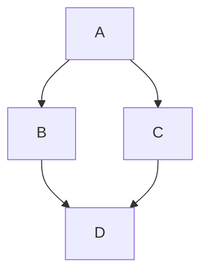

## About

Notes of my professional and daily life.





```html
<div class="mermaid">
graph TD;
A-->B;
A-->C;
B-->D;
C-->D;
</div>
```

<div class="mermaid">
    graph TD 
    A[Client] --> B[Load Balancer]
    B --> C[Server01]
    B --> D[Server02]
</div>
